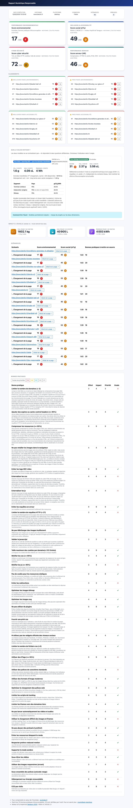
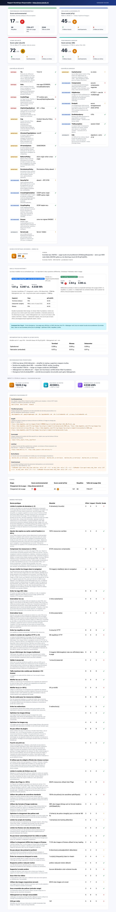
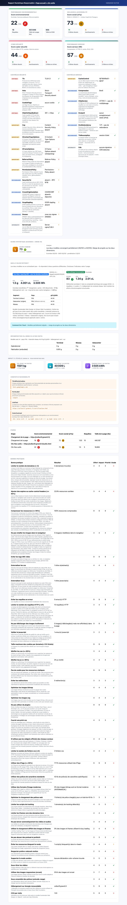

[English version](./README_EN.md)

# nr-analysis-cli

CLI Node.js d'analyse de l'empreinte écologique de pages web, basé sur l'extension Chrome [GreenIT-Analysis](https://github.com/cnumr/GreenIT-Analysis).

L'outil simule l'exécution de l'extension sur les pages spécifiées, ouvertes dans Chromium via Puppeteer. Le cache est désactivé pour fiabiliser l'analyse. Il calcule l'**EcoIndex**, la consommation d'eau et les émissions de GES, et vérifie le respect de bonnes pratiques d'éco-conception.

---

# Sommaire

- [Pour commencer](#pour-commencer)
  - [Prérequis](#prérequis)
  - [Installation](#installation)
- [Usage](#usage)
  - [Analyse](#analyse)
    - [Analyse directe d'une URL](#analyse-directe-dune-url)
    - [Analyse via fichier YAML](#analyse-via-fichier-yaml)
      - [Construction du fichier d'entrée](#construction-du-fichier-dentrée)
      - [Conditions d'attente](#conditions-dattente)
      - [Actions](#actions)
        - [click](#click)
        - [press](#press)
        - [scroll](#scroll)
        - [select](#select)
        - [text](#text)
    - [Analyse récursive (crawl)](#analyse-récursive-crawl)
    - [Commande complète](#commande-complète)
    - [Formats des rapports](#formats-des-rapports)
      - [Excel (xlsx)](#excel-xlsx)
      - [HTML](#html)
      - [InfluxDB/Grafana](#influxdbgrafana)
  - [ParseSiteMap](#parsesitemap)
  - [Flags généraux](#flags-généraux)
- [Conditions d'utilisation](#conditions-dutilisation)

---

# Pour commencer

## Prérequis

- [Node.js](https://nodejs.org/) (version LTS recommandée)

## Installation

```bash
git clone https://github.com/Institut-du-Numerique-Responsable/nr-analysis-cli.git
cd nr-analysis-cli
npm install
npm link
```

La commande `npm link` crée un lien symbolique global permettant d'utiliser `nr` directement dans le terminal.

---

# Usage

## Analyse

### Analyse directe d'une URL

La manière la plus rapide d'analyser un site :

```bash
nr analyse --url https://www.example.com
```

Le rapport HTML est automatiquement enregistré dans `~/Downloads/<hostname>.html`.

Options utiles en mode `--url` :

```bash
nr analyse --url https://www.example.com --output /tmp/rapport.html --format html
```

### Analyse via fichier YAML

Pour analyser plusieurs pages ou définir des parcours utilisateur complexes, créez un fichier YAML :

```bash
nr analyse url.yaml results.html
```

Un exemple de fichier est disponible dans le dossier `samples/`.

#### Construction du fichier d'entrée

Le fichier `<url_input_file>` liste les URL à analyser au format YAML.

| Paramètre           | Type    | Obligatoire | Description                                                         |
| ------------------- | ------- | ----------- | ------------------------------------------------------------------- |
| `url`               | string  | Oui         | URL de la page à analyser                                           |
| `name`              | string  | Non         | Nom affiché dans le rapport                                         |
| `waitForSelector`   | string  | Non         | Attend que l'élément HTML défini par le sélecteur CSS soit visible  |
| `waitForXPath`      | string  | Non         | Attend que l'élément HTML défini par le XPath soit visible          |
| `waitForNavigation` | string  | Non         | Attend la fin du chargement. Valeurs : `load`, `domcontentloaded`, `networkidle0`, `networkidle2` |
| `waitForTimeout`    | int     | Non         | Attend X ms                                                         |
| `screenshot`        | string  | Non         | Réalise une capture d'écran de la page (même en cas d'erreur)       |
| `actions`           | list    | Non         | Réalise une suite d'actions avant d'analyser la page                |

#### Conditions d'attente

Le paramètre `waitForNavigation` exploite les fonctionnalités de Puppeteer :

- `load` : navigation terminée quand l'événement `load` est déclenché.
- `domcontentloaded` : navigation terminée quand `DOMContentLoaded` est déclenché.
- `networkidle0` : pas plus de 0 connexion réseau pendant 500 ms.
- `networkidle2` : pas plus de 2 connexions réseau pendant 500 ms.

Par défaut (aucun `waitFor` défini), l'outil attend l'événement `load`.

Exemple de fichier `url.yaml` :

```yaml
- name: 'Page d'accueil'
  url: 'https://www.example.com/'

- name: 'À propos'
  url: 'https://www.example.com/about'
  waitForSelector: '#main-content'
  screenshot: 'results/screenshots/about.png'

- url: 'https://www.example.com/contact'
  waitForXPath: '//h1'
```

#### Actions

Les actions permettent de définir un parcours utilisateur avant l'analyse.

| Paramètre           | Type    | Obligatoire | Description                                                                 |
| ------------------- | ------- | ----------- | --------------------------------------------------------------------------- |
| `name`              | string  | Non         | Nom de l'action                                                             |
| `type`              | string  | Oui         | Type : `click`, `press`, `scroll`, `select`, `text`                         |
| `element`           | string  | Non         | Sélecteur CSS de l'élément DOM cible                                        |
| `pageChange`        | boolean | Non         | Si `true`, l'action déclenche un changement de page. Défaut : `false`       |
| `timeoutBefore`     | int     | Non         | Temps d'attente avant l'action (ms). Défaut : 1000                          |
| `waitForSelector`   | string  | Non         | Attend que le sélecteur CSS soit visible après l'action                     |
| `waitForXPath`      | string  | Non         | Attend que le XPath soit visible après l'action                             |
| `waitForNavigation` | string  | Non         | Attend la fin du chargement après l'action                                  |
| `waitForTimeout`    | int     | Non         | Attend X ms après l'action                                                  |
| `screenshot`        | string  | Non         | Capture d'écran après l'action (même en cas d'erreur)                       |

##### click

Simule un clic sur un élément de la page.

| Paramètre | Type   | Obligatoire | Description                            |
| --------- | ------ | ----------- | -------------------------------------- |
| `element` | string | Oui         | Sélecteur CSS de l'élément à cliquer   |

```yaml
- name: 'Exemple avec clic'
  url: 'https://www.example.com/'
  actions:
    - name: 'Ouvrir le menu'
      type: 'click'
      element: 'button[aria-label="Menu"]'
      pageChange: true
      waitForSelector: '#nav-menu'
```

##### press

Simule l'appui sur une touche du clavier.

| Paramètre | Type   | Obligatoire | Description                                             |
| --------- | ------ | ----------- | ------------------------------------------------------- |
| `key`     | string | Oui         | Touche clavier reconnue par Puppeteer (ex. `Enter`, `Tab`) |

```yaml
- name: 'Exemple avec touche'
  url: 'https://www.example.com/'
  actions:
    - name: 'Valider avec Entrée'
      type: 'press'
      key: 'Enter'
      waitForTimeout: 1500
```

##### scroll

Simule le défilement vers le bas de la page.

```yaml
- name: 'Page avec scroll'
  url: 'https://www.example.com/'
  actions:
    - name: 'Scroll automatique'
      type: 'scroll'
```

##### select

Simule la sélection de valeurs dans une liste déroulante.

| Paramètre | Type   | Obligatoire | Description                                              |
| --------- | ------ | ----------- | -------------------------------------------------------- |
| `element` | string | Oui         | Sélecteur CSS du `<select>`                              |
| `values`  | list   | Oui         | Liste des valeurs à sélectionner                         |

```yaml
- name: 'Exemple avec select'
  url: 'https://www.example.com/'
  actions:
    - name: 'Choisir une catégorie'
      type: 'select'
      element: '#category'
      values: ['technology']
```

##### text

Simule la saisie de texte dans un champ de formulaire.

| Paramètre | Type   | Obligatoire | Description                            |
| --------- | ------ | ----------- | -------------------------------------- |
| `element` | string | Oui         | Sélecteur CSS du champ                 |
| `content` | string | Oui         | Texte à saisir                         |

```yaml
- name: 'Formulaire de contact'
  url: 'https://www.example.com/contact'
  actions:
    - name: 'Saisir l'email'
      type: 'text'
      element: '#email'
      content: 'test@example.com'
      timeoutBefore: 1000
```

### Analyse récursive (crawl)

L'outil peut crawler automatiquement les liens internes d'un site à partir d'une URL de départ :

```bash
nr analyse --url https://www.example.com --recursive --depth 3 --max_pages 50
```

| Option        | Description                                               | Défaut |
| ------------- | --------------------------------------------------------- | ------ |
| `--recursive` | Active le crawl des liens internes (nécessite `--url`)    | false  |
| `--depth`     | Profondeur maximale du crawl                              | 5      |
| `--max_pages` | Nombre maximum de pages à analyser                        | 200    |

### Commande complète

```
nr analyse [url_input_file] [report_output_file] [options]
```

**Paramètres positionnels :**

| Paramètre            | Description                                      | Défaut          |
| -------------------- | ------------------------------------------------ | --------------- |
| `url_input_file`     | Chemin vers le fichier YAML listant les URL      | `url.yaml`      |
| `report_output_file` | Chemin du fichier de rapport généré              | `results.xlsx`  |

**Options :**

| Option                | Alias | Description                                                               | Défaut    |
| --------------------- | ----- | ------------------------------------------------------------------------- | --------- |
| `--url`               |       | URL à analyser directement (bypass du fichier YAML)                       |           |
| `--output`            | `-o`  | Chemin du rapport (utilisé avec `--url`)                                  |           |
| `--format`            | `-f`  | Format du rapport : `xlsx`, `html`, `influxdb`, `influxdbhtml`            |           |
| `--device`            | `-d`  | Terminal à émuler                                                         | `desktop` |
| `--headers`           | `-h`  | Chemin vers un fichier YAML de headers HTTP                               |           |
| `--headless`          |       | Mode headless du navigateur (`true`/`false`)                              | `true`    |
| `--language`          |       | Langue du rapport (`fr`, `en`)                                            | `fr`      |
| `--login`             | `-l`  | Chemin vers un fichier YAML de configuration de login                     |           |
| `--max_tab`           |       | Nombre d'URL analysées en parallèle                                       | `40`      |
| `--mobile`            |       | Connexion mobile (`true`) ou filaire (`false`)                            | `false`   |
| `--proxy`             | `-p`  | Chemin vers un fichier YAML de configuration du proxy                     |           |
| `--retry`             | `-r`  | Nombre d'essais supplémentaires en cas d'échec                            | `2`       |
| `--timeout`           | `-t`  | Timeout de chargement d'une URL (ms)                                      | `180000`  |
| `--worst_pages`       |       | Nombre de pages prioritaires dans le résumé                               | `5`       |
| `--worst_rules`       |       | Nombre de bonnes pratiques prioritaires dans le résumé                    | `5`       |
| `--recursive`         |       | Crawl récursif des liens internes (nécessite `--url`)                     | `false`   |
| `--depth`             |       | Profondeur maximale du crawl                                              | `5`       |
| `--max_pages`         |       | Nombre maximum de pages à crawler et analyser                             | `200`     |
| `--grafana_link`      |       | URL du dashboard Grafana (format `influxdbhtml`)                          |           |
| `--influxdb_hostname` |       | URL de la base InfluxDB                                                   |           |
| `--influxdb_org`      |       | Nom de l'organisation InfluxDB                                            |           |
| `--influxdb_token`    |       | Token de connexion InfluxDB                                               |           |
| `--influxdb_bucket`   |       | Bucket InfluxDB                                                           |           |

**Terminaux supportés (`--device`) :**

`desktop`, `galaxyS9`, `galaxyS20`, `iPhone8`, `iPhone8Plus`, `iPhoneX`, `iPad`

**Exemple de `headers.yaml` :**

```yaml
accept: 'text/html,application/xhtml+xml,application/xml'
accept-encoding: 'gzip, deflate, br'
accept-language: 'fr-FR,fr;q=0.9'
```

**Exemple de `login.yaml` :**

```yaml
url: 'https://www.example.com/login'
fields:
  - selector: '#username'
    value: monlogin
  - selector: '#password'
    value: monmotdepasse
loginButtonSelector: '#btn-login'
waitForTimeout: 2000
```

**Exemple de `proxy.yaml` :**

```yaml
server: '<host>:<port>'
user: '<username>'
password: '<password>'
```

### Formats des rapports

#### Excel (xlsx)

```bash
nr analyse url.yaml results.xlsx
# ou
nr analyse url.yaml results --format xlsx
```

Le rapport Excel contient :
- Un onglet global : moyenne de l'EcoIndex, pages et règles prioritaires à corriger.
- Un onglet par URL : EcoIndex, consommation eau/GES, tableau des bonnes pratiques.


#### HTML

```bash
nr analyse url.yaml results.html
# ou
nr analyse --url https://www.example.com --format html
```

Le rapport HTML contient :
- Une page résumé : nombre de scénarios, erreurs, tableau récapitulatif, bonnes pratiques non respectées.
- Une page par scénario : détail des requêtes, poids, EcoIndex, eau, GES et bonnes pratiques.





#### InfluxDB/Grafana

Envoie les données vers une instance InfluxDB pour visualisation dans Grafana :

```bash
nr analyse url.yaml --format influxdb \
  --influxdb_hostname http://localhost:8086 \
  --influxdb_org mon-org \
  --influxdb_token mon-token \
  --influxdb_bucket mon-bucket
```

Pour générer simultanément un rapport HTML avec lien Grafana :

```bash
nr analyse url.yaml results.html --format influxdbhtml \
  --influxdb_hostname http://localhost:8086 \
  --influxdb_org mon-org \
  --influxdb_token mon-token \
  --influxdb_bucket mon-bucket \
  --grafana_link http://localhost:3000/d/YoK0Xjb4k/nr-analysis
```


---

## ParseSiteMap

Convertit une sitemap XML en fichier YAML utilisable par `nr analyse` :

```bash
nr parseSitemap https://www.example.com/sitemap.xml url.yaml
```

| Paramètre          | Description                                   | Défaut     |
| ------------------ | --------------------------------------------- | ---------- |
| `sitemap_url`      | URL de la sitemap à transformer               | *(requis)* |
| `yaml_output_file` | Chemin du fichier YAML généré                 | `url.yaml` |

## Flags généraux

| Flag   | Description                                                        |
| ------ | ------------------------------------------------------------------ |
| `--ci` | Désactive la barre de progression pour les environnements CI/CD    |

---

# Conditions d'utilisation

Cet outil s'appuie sur l'API de l'extension GreenIT-Analysis qui **ne permet pas une utilisation à des fins commerciales**.
