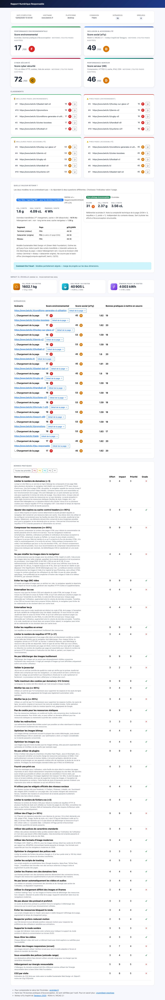
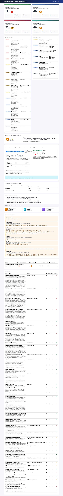

[Version française](./README.md)

# nr-analysis-cli

Node.js CLI for analyzing the ecological footprint of web pages, based on the [GreenIT-Analysis](https://github.com/cnumr/GreenIT-Analysis) Chrome extension.

The tool simulates running the extension on specified pages opened in Chromium via Puppeteer. The cache is disabled to ensure reliable analysis. It computes the **EcoIndex**, water consumption, GHG emissions, and checks eco-design best practices.

---

## 2026 update

This version adds CLI flags for direct-URL analysis and crawling, and extends the eco-design rules.

### New CLI features

| Feature | Description |
| ------- | ----------- |
| `--url <url>` | Directly analyze a URL without a YAML file — HTML report auto-saved to `~/Downloads/` |
| `--recursive` | Automatically crawl internal links from a starting URL |
| `--depth <n>` | Maximum crawl depth (default: 5) |
| `--max_pages <n>` | Maximum number of pages to crawl and analyze (default: 200) |
| `--language en` | Reports available in French and English |

### Eco-design rules

8 rules were added to cover practices that barely existed when the original rule engine was written:

| Rule | What it checks |
| ---- | -------------- |
| Modern image formats | Detects JPEG, PNG, GIF, BMP — recommends AVIF, WebP or JPEG XL |
| Lazy loading for images & iframes | Checks `loading="lazy"` on both `` and `<iframe>` elements |
| Tracking scripts | Detects 30+ tracking domains: Google, Meta, TikTok Pixel, Snapchat Pixel, Pinterest Tag, Reddit Pixel, OneTrust, Cookiebot, Klaviyo, Brevo… |
| Autoplay video/audio | Flags any `<video>` or `<audio>` with the `autoplay` attribute |
| Font optimization | Controls font file count (≤ 2) and total weight (≤ 100 KB) |
| Render-blocking resources | Detects `<script>` tags in `<head>` without `async`, `defer`, or `type="module"` |
| External iframes | Counts iframes pointing to third-party domains |
| Excessive preload/prefetch | Flags more than 5 `<link rel="preload/prefetch">` directives |

6 existing rules were updated too: social network widgets now cover X.com and LinkedIn badges, HTTP compression documentation recommends Brotli over gzip, browser plugin detection extends to `<object>` and `<embed>`, and the FR/EN locale strings were refreshed to match.

### Technical stack

Puppeteer 23.9+ (headless Chromium, SSL error ignore, non-headless mode), Node.js ES2020+ (CommonJS, native async/await), Mustache-based reports with full FR/EN i18n.

---

# Summary

- [Getting started](#getting-started)
  - [Quick start (5 min)](#quick-start-5-min)
  - [Prerequisites](#prerequisites)
  - [Detailed installation](#detailed-installation)
- [Usage](#usage)
  - [Analysis](#analysis)
    - [Direct URL analysis](#direct-url-analysis)
    - [Multi-page analysis from a flat `urls.txt` file](#multi-page-analysis-from-a-flat-urlstxt-file)
    - [Analysis from a YAML file (user journeys)](#analysis-from-a-yaml-file-user-journeys)
      - [Input file structure](#input-file-structure)
      - [Waiting conditions](#waiting-conditions)
      - [Actions](#actions)
        - [click](#click)
        - [press](#press)
        - [scroll](#scroll)
        - [select](#select)
        - [text](#text)
    - [Recursive analysis (crawl)](#recursive-analysis-crawl)
    - [Full command reference](#full-command-reference)
    - [Carbon footprint — methodology](#carbon-footprint--methodology)
    - [Report formats](#report-formats)
      - [Excel (xlsx)](#excel-xlsx)
      - [HTML](#html)
      - [InfluxDB/Grafana](#influxdbgrafana)
  - [ParseSiteMap](#parsesitemap)
  - [General flags](#general-flags)
- [Rules reference](#rules-reference)
- [License and terms of use](#license-and-terms-of-use)

---

# Getting started

## Quick start (5 min)

If you're new to the tool, here are the four steps to produce your first report.

```bash
# 1. Install Node.js (LTS) — https://nodejs.org/
# 2. Clone and install the project
git clone https://github.com/Institut-du-Numerique-Responsable/nr-analysis-cli.git
cd nr-analysis-cli
npm install
npm link

# 3. Audit a URL
nr analyse --url https://isit-europe.org/fr/

# 4. Audit several pages from urls.txt (provided)
nr analyse urls.txt
```

The HTML report opens in any browser (`open` on macOS, `xdg-open` on Linux, double-click on Windows).

### Typical command — full crawl audit of a French site

Typical case: automatically crawling a public-facing site hosted or accessed from France, using the NegaOctet/ARCEP/ADEME methodology.

```bash
nr analyse \
  --url https://www.bigben-connected.com/ \
  --recursive \
  --depth 2 \
  --max_pages 25 \
  --ci
```

| Flag             | Role |
| ---------------- | ---- |
| `--url <URL>`    | Starting URL (required for `--recursive`) |
| `--recursive`    | Automatically crawl internal links |
| `--depth 2`      | Depth 2 (starting URL + 2 levels) |
| `--max_pages 25` | Caps the audit at 25 pages |
| `--ci`           | Disables the progress bar (clean text output) |

`--country FRA`, `--language fr`, `--methodology negaoctet` and `--wait_until domcontentloaded` are the default values.

The global report is written to `~/Downloads/<date>_<host>.html` (`--url` mode) or `resultat/<date>_<host>_index.html` (`urls.txt` file mode).

### Cheat sheet — running an analysis on a new site

Replace the URL with the site to audit. Example with `https://institutnr.org/`:

```bash
cd ~/nr-analysis-cli

nr analyse \
  --url https://institutnr.org/ \
  --recursive \
  --depth 2 \
  --max_pages 25 \
  --ci
```

The HTML report is generated in `~/Downloads/<date>_institutnr.org.html`.

For a larger audit (content-rich site):

```bash
nr analyse \
  --url https://institutnr.org/ \
  --recursive \
  --depth 3 \
  --max_pages 100 \
  --ci
```

**If you keep hitting timeouts**, force `--wait_until networkidle2` (waits for network activity to settle) or `--wait_until load` (Puppeteer's native behavior):

```bash
nr analyse \
  --url https://institutnr.org/ \
  --recursive \
  --depth 2 \
  --max_pages 25 \
  --wait_until networkidle2 \
  --ci
```

| `--wait_until`     | When to use it |
| ------------------ | --------------- |
| `domcontentloaded` | **default** — HTML parsed, works around blocking scripts / anti-bot checks |
| `networkidle2`     | waits for ≤ 2 active connections for 500 ms — good trade-off |
| `load`             | waits for all resources to load (Puppeteer native) |
| `networkidle0`     | waits for 0 connections — strict, can time out on sites with polling |

---

### Shell alias (optional)

To avoid repeating the FR/NegaOctet flags, add to `~/.zshrc` (or `~/.bashrc`):

```bash
alias nr-fr='nr analyse --ci'
alias nr-fr-crawl='nr analyse --ci --recursive --depth 2 --max_pages 25'
```

Then:

```bash
nr-fr --url https://www.example.com           # single-page audit
nr-fr urls.txt                                # audit a list file
nr-fr-crawl --url https://www.example.com     # crawl 25 pages, depth 2
```

## Prerequisites

- **[Node.js](https://nodejs.org/) 18 or later** (LTS recommended). Check with `node -v`.
- **npm** (bundled with Node.js). Check with `npm -v`.
- **git** to clone the repository.
- An internet connection (the tool downloads Chromium on first `npm install`).

No need to install Chrome separately: Puppeteer bundles its own Chromium build.

## Detailed installation

```bash
git clone https://github.com/Institut-du-Numerique-Responsable/nr-analysis-cli.git
cd nr-analysis-cli
npm install
npm link
```

- `npm install` installs the dependencies **and** Chromium (~150 MB, first run only).
- `npm link` creates a global symlink so you can use the `nr` command from any folder.

### Check the installation

```bash
nr --help
```

You should see the list of commands (`analyse`, `parseSitemap`).

### Common troubleshooting

| Problem | Solution |
| ------- | -------- |
| `nr: command not found` after `npm link` | On Linux/macOS, add `$(npm prefix -g)/bin` to `PATH`, or restart your terminal. On Windows, use PowerShell as administrator. |
| `EACCES` during `npm link` | `sudo npm link` (or set up a user npm prefix — see the [npm docs](https://docs.npmjs.com/resolving-eacces-permissions-errors-when-installing-packages-globally)). |
| Chromium won't download | Retry with `PUPPETEER_DOWNLOAD_HOST=https://storage.googleapis.com npm install`. |
| `SSL` error on an internal site | The tool already ignores SSL errors by default (Puppeteer 23+). |

---

# Usage

## Analysis

### Direct URL analysis

The fastest way to analyze a website:

```bash
nr analyse --url https://www.example.com
```

The HTML report is automatically saved to `~/Downloads/<hostname>.html`.

Useful options with `--url`:

```bash
nr analyse --url https://www.example.com --output /tmp/report.html --format html
```

### Multi-page analysis from a flat `urls.txt` file

The simplest way to audit a batch of pages: one URL per line in a text file. The global report aggregates averages, **best/worst page rankings** (environment and accessibility) and keeps per-page detail.

#### 1. Fill in `urls.txt`

A sample file ships at the repository root (`urls.txt`). Format:

```
# Comments start with #
# One URL per line, empty lines are ignored

https://www.example.com/
https://www.example.com/products
https://www.example.com/contact
```

Rules:
- one URL per line, no quotes or separators
- lines starting with `#` are ignored (comments)
- empty lines are ignored
- URLs must include the protocol (`https://`)

#### 2. Run the audit

```bash
nr analyse urls.txt
```

Output is generated in the `resultat/` folder at the repository root:

Files are prefixed with the date (`YYYYMMDDHHMM`) and the hostname of the first site, so previous audits are never overwritten.

| File | Content |
| ---- | ------- |
| `resultat/<date>_<host>_index.html` | Global report: environment + social + cyber + server averages, CO₂/water/energy KPIs for 1M visits, top/bottom rankings, page table |
| `resultat/<date>_<host>_<n>.html` | Detailed report for each audited page (a11y, best practices, steps, cyber + server checks) |

Example: `resultat/202605120945_isit-europe.org_index.html`

Opening the report:

```bash
open resultat/index.html       # macOS
xdg-open resultat/index.html   # Linux
```

#### 3. Useful options

```bash
# Adjust the number of pages shown in the rankings
nr analyse urls.txt --worst_pages 10

# Mobile audit
nr analyse urls.txt --mobile

# Report in English
nr analyse urls.txt --language en
```

### Analysis from a YAML file (user journeys)

To define **user journeys** (click, type, log in, scroll), create a YAML file:

```bash
nr analyse url.yaml results.html
```

A sample file is available in the `samples/` folder.

#### Input file structure

The `<url_input_file>` lists URLs to analyze in YAML format.

| Parameter           | Type    | Required | Description                                                          |
| ------------------- | ------- | -------- | ---------------------------------------------------------------------|
| `url`               | string  | Yes      | URL of the page to analyze                                           |
| `name`              | string  | No       | Name displayed in the report                                         |
| `waitForSelector`   | string  | No       | Wait for the HTML element defined by the CSS selector to be visible  |
| `waitForXPath`      | string  | No       | Wait for the HTML element defined by the XPath to be visible         |
| `waitForNavigation` | string  | No       | Wait for the page to finish loading. Values: `load`, `domcontentloaded`, `networkidle0`, `networkidle2` |
| `waitForTimeout`    | int     | No       | Wait X ms                                                             |
| `screenshot`        | string  | No       | Take a screenshot of the page (even on error)                        |
| `actions`           | list    | No       | Perform a series of actions before analyzing the page                |

#### Waiting conditions

The `waitForNavigation` parameter uses Puppeteer features to detect page load completion:

- `load`: navigation is complete when the `load` event fires.
- `domcontentloaded`: navigation is complete when the `DOMContentLoaded` event fires.
- `networkidle0`: no more than 0 network connections for at least 500 ms.
- `networkidle2`: no more than 2 network connections for at least 500 ms.

By default (no `waitFor` parameter defined), the tool waits for the `load` event.

Example `url.yaml` file:

```yaml
- name: 'Home'
  url: 'https://www.example.com/'

- name: 'About'
  url: 'https://www.example.com/about'
  waitForSelector: '#main-content'
  screenshot: 'results/screenshots/about.png'

- url: 'https://www.example.com/contact'
  waitForXPath: '//h1'
```

#### Actions

Actions let you define a user journey before the analysis runs.

| Parameter           | Type    | Required | Description                                                                |
| ------------------- | ------- | -------- | ---------------------------------------------------------------------------|
| `name`              | string  | No       | Name of the action                                                         |
| `type`              | string  | Yes      | Type: `click`, `press`, `scroll`, `select`, `text`                         |
| `element`           | string  | No       | CSS selector of the target DOM element                                     |
| `pageChange`        | boolean | No       | If `true`, the action triggers a page change. Default: `false`             |
| `timeoutBefore`     | int     | No       | Wait time before the action (ms). Default: 1000                            |
| `waitForSelector`   | string  | No       | Wait for the CSS selector to be visible after the action                   |
| `waitForXPath`      | string  | No       | Wait for the XPath to be visible after the action                          |
| `waitForNavigation` | string  | No       | Wait for the page to finish loading after the action                       |
| `waitForTimeout`    | int     | No       | Wait X ms after the action                                                 |
| `screenshot`        | string  | No       | Take a screenshot after the action (even on error)                         |

##### click

Simulates a click on a page element.

| Parameter | Type   | Required | Description                          |
| --------- | ------ | -------- | --------------------------------------|
| `element` | string | Yes      | CSS selector of the element to click |

```yaml
- name: 'Example with click'
  url: 'https://www.example.com/'
  actions:
    - name: 'Open menu'
      type: 'click'
      element: 'button[aria-label="Menu"]'
      pageChange: true
      waitForSelector: '#nav-menu'
```

##### press

Simulates pressing a keyboard key.

| Parameter | Type   | Required | Description                                                |
| --------- | ------ | -------- | ------------------------------------------------------------|
| `key`     | string | Yes      | Keyboard key recognized by Puppeteer (e.g. `Enter`, `Tab`) |

```yaml
- name: 'Example with key press'
  url: 'https://www.example.com/'
  actions:
    - name: 'Submit with Enter'
      type: 'press'
      key: 'Enter'
      waitForTimeout: 1500
```

##### scroll

Simulates scrolling to the bottom of the page.

```yaml
- name: 'Page with scroll'
  url: 'https://www.example.com/'
  actions:
    - name: 'Auto scroll to bottom'
      type: 'scroll'
```

##### select

Simulates selecting values from a dropdown list.

| Parameter | Type   | Required | Description                          |
| --------- | ------ | -------- | ---------------------------------------|
| `element` | string | Yes      | CSS selector of the `<select>`       |
| `values`  | list   | Yes      | List of values to select             |

```yaml
- name: 'Example with select'
  url: 'https://www.example.com/'
  actions:
    - name: 'Choose a category'
      type: 'select'
      element: '#category'
      values: ['technology']
```

##### text

Simulates typing text into a form field.

| Parameter | Type   | Required | Description                      |
| --------- | ------ | -------- | -----------------------------------|
| `element` | string | Yes      | CSS selector of the input field  |
| `content` | string | Yes      | Text to type                     |

```yaml
- name: 'Contact form'
  url: 'https://www.example.com/contact'
  actions:
    - name: 'Enter email'
      type: 'text'
      element: '#email'
      content: 'test@example.com'
      timeoutBefore: 1000
```

### Recursive analysis (crawl)

The tool can automatically crawl internal links from a starting URL:

```bash
nr analyse --url https://www.example.com --recursive --depth 3 --max_pages 50
```

| Option        | Description                                             | Default |
| ------------- | --------------------------------------------------------- | ------- |
| `--recursive` | Enable recursive crawl of internal links (requires `--url`) | false   |
| `--depth`     | Maximum crawl depth                                     | 5       |
| `--max_pages` | Maximum number of pages to crawl and analyze            | 200     |

### Full command reference

```
nr analyse [url_input_file] [report_output_file] [options]
```

**Positional parameters:**

| Parameter            | Description                                   | Default         |
| -------------------- | --------------------------------------------- | --------------- |
| `url_input_file`     | Path to the YAML file listing URLs to analyze | `url.yaml`      |
| `report_output_file` | Path to the output report file                | `results.xlsx`  |

**Options:**

| Option                | Alias | Description                                                               | Default   |
| --------------------- | ----- | ----------------------------------------------------------------------------| --------- |
| `--url`               |       | URL to analyze directly (bypasses the YAML file)                          |           |
| `--output`            | `-o`  | Report output path (used with `--url`)                                    |           |
| `--format`            | `-f`  | Report format: `xlsx`, `html`, `influxdb`, `influxdbhtml`                 |           |
| `--device`            | `-d`  | Device to emulate                                                         | `desktop` |
| `--headers`           | `-h`  | Path to a YAML file with HTTP headers                                     |           |
| `--headless`          |       | Browser headless mode (`true`/`false`)                                    | `true`    |
| `--language`          |       | Report language (`fr`, `en`)                                              | `fr`      |
| `--login`             | `-l`  | Path to a YAML login configuration file                                   |           |
| `--max_tab`           |       | Number of URLs analyzed in parallel                                       | `40`      |
| `--mobile`            |       | Mobile (`true`) or wired (`false`) connection                             | `false`   |
| `--proxy`             | `-p`  | Path to a YAML proxy configuration file                                   |           |
| `--retry`             | `-r`  | Number of additional attempts on failure                                  | `2`       |
| `--timeout`           | `-t`  | URL load timeout (ms)                                                     | `180000`  |
| `--worst_pages`       |       | Number of priority pages shown in the summary                             | `5`       |
| `--worst_rules`       |       | Number of priority rules shown in the summary                             | `5`       |
| `--recursive`         |       | Recursive crawl of internal links (requires `--url`)                      | `false`   |
| `--depth`             |       | Maximum crawl depth                                                       | `5`       |
| `--max_pages`         |       | Maximum number of pages to crawl and analyze                              | `200`     |
| `--country`           |       | Visitor/device country — ISO 3166-1 alpha-3 (`FRA`, `USA`, `DEU`…). Drives the device segment's carbon intensity in SWDM v4 | `FRA` |
| `--dc_country`        |       | Datacenter/origin country — ISO 3166-1 alpha-3. Auto-detected via `x-amz-cf-pop`, `cf-ray`, then IP geolocation (ipapi.co) if omitted | auto |
| `--grid_device_gco2`  |       | Override device carbon intensity in gCO₂/kWh (plug in an up-to-date Electricity Maps value). Takes priority over `--country` |           |
| `--grid_dc_gco2`      |       | Override datacenter carbon intensity in gCO₂/kWh                          |           |
| `--grid_network_gco2` |       | Override network carbon intensity in gCO₂/kWh                             |           |
| `--methodology`       |       | CO₂ model: `negaoctet` (SWDM v4 + a device lifecycle overhead calibrated on NegaOctet/ARCEP/ADEME for France) or `swdm-v4` (bytes transferred only) | `negaoctet` |
| `--wait_until`        |       | Puppeteer navigation event to wait for: `domcontentloaded`, `load`, `networkidle0`, `networkidle2` | `domcontentloaded` |
| `--grafana_link`      |       | Grafana dashboard URL (for `influxdbhtml` format)                         |           |
| `--influxdb_hostname` |       | InfluxDB instance URL                                                     |           |
| `--influxdb_org`      |       | InfluxDB organization name                                                |           |
| `--influxdb_token`    |       | InfluxDB connection token                                                 |           |
| `--influxdb_bucket`   |       | InfluxDB bucket                                                           |           |

### Carbon footprint — methodology

The tool exposes three complementary indicators in the report:

| Indicator | Model | What it's for |
| --------- | ----- | -------------- |
| SWDM v4 | bytes × kWh/GB × gCO₂/kWh (Sustainable Web Design v4, Green Web Foundation) | GHG accounting, delivery scope (device + network + origin datacenter) |
| EcoIndex | official ecoindex.fr formula (DOM × 3, requests × 2, weight × 1) | Structural eco-design tracking |
| Synthetic score | EcoIndex and SWD, normalized then weighted 50/50, with a confidence factor | Overall page score |

The `--methodology negaoctet` flag enriches SWDM v4 with a per-visit overhead calibrated on French studies (NegaOctet 2022, ARCEP/ADEME 2022, ADEME Base Empreinte 2024), capturing the device lifecycle share that the bytes-only model misses. Recommended for a public-facing site hosted or accessed in France.

The `--dc_country` flag (or CDN/IP auto-detection) separates the datacenter's carbon intensity from the visitor's. This matters when the datacenter country differs from the visitor's country — for example a French visitor with hosting on AWS Ireland.

**Supported devices (`--device`):**

`desktop`, `galaxyS9`, `galaxyS20`, `iPhone8`, `iPhone8Plus`, `iPhoneX`, `iPad`

**Example `headers.yaml`:**

```yaml
accept: 'text/html,application/xhtml+xml,application/xml'
accept-encoding: 'gzip, deflate, br'
accept-language: 'en-US,en;q=0.9'
```

**Example `login.yaml`:**

```yaml
url: 'https://www.example.com/login'
fields:
  - selector: '#username'
    value: mylogin
  - selector: '#password'
    value: mypassword
loginButtonSelector: '#btn-login'
waitForTimeout: 2000
```

**Example `proxy.yaml`:**

```yaml
server: '<host>:<port>'
user: '<username>'
password: '<password>'
```

### Report formats

#### Excel (xlsx)

```bash
nr analyse url.yaml results.xlsx
# or
nr analyse url.yaml results --format xlsx
```

The Excel report contains:
- A global tab: average EcoIndex, priority pages and rules to fix.
- A tab per URL: EcoIndex, water/GHG indicators, best practices table.


#### HTML

```bash
nr analyse url.yaml results.html
# or
nr analyse --url https://www.example.com --format html
```

The HTML report contains:
- A summary page: number of scenarios, errors, summary table, non-compliant best practices.
- One page per scenario: HTTP requests, page weight, EcoIndex, water, GHG, best practices.




#### InfluxDB/Grafana

Sends data to an InfluxDB instance for visualization in Grafana:

```bash
nr analyse url.yaml --format influxdb \
  --influxdb_hostname http://localhost:8086 \
  --influxdb_org my-org \
  --influxdb_token my-token \
  --influxdb_bucket my-bucket
```

To simultaneously generate an HTML report with a Grafana link:

```bash
nr analyse url.yaml results.html --format influxdbhtml \
  --influxdb_hostname http://localhost:8086 \
  --influxdb_org my-org \
  --influxdb_token my-token \
  --influxdb_bucket my-bucket \
  --grafana_link http://localhost:3000/d/YoK0Xjb4k/nr-analysis
```


---

## ParseSiteMap

Converts an XML sitemap into a YAML file usable by `nr analyse`:

```bash
nr parseSitemap https://www.example.com/sitemap.xml url.yaml
```

| Parameter          | Description                          | Default    |
| ------------------ | ------------------------------------- | ---------- |
| `sitemap_url`      | URL of the sitemap to convert        | *(required)* |
| `yaml_output_file` | Path to the generated YAML file      | `url.yaml` |

## General flags

| Flag   | Description                                              |
| ------ | ----------------------------------------------------------|
| `--ci` | Disables the progress bar for CI/CD environments         |

---

# Rules reference

Every audited page is scored on 4 independent axes. The overall grade runs from **A** (excellent) to **G** (very poor).

| Axis | Score | Rule source |
| ---- | ----- | ------------ |
| Environment | 0–100 | 38 eco-design rules (RGESN, GR491, WSG) run in-page |
| Social (a11y) | 0–100 | 12 Tanaguru/RGAA checks + 5 additional checks |
| Security (cyber) | 0–100 | 13 server checks (TLS, HTTP headers, cookies, DNSSEC…) |
| Server performance | 0–100 | 9 infrastructure checks (HTTP/2, compression, cache, CDN…) |

Each rule returns a compliance level:

- `A`: rule met
- `B`: minor improvement needed
- `C`: rule not met

The overall score for an axis is the weighted average of these levels, by criticality.

---

## 1. Environment — eco-design rules (38)

### 1.1 Transfer optimization (weight and requests)

| Rule | ID | What it measures | Pass criterion |
| ---- | -- | ------------------ | ---------------|
| Limit the number of domains | `DomainsNumber` | Number of third-party domains contacted | < 3 |
| Limit the number of HTTP requests | `HttpRequests` | Total number of requests | < 27 |
| Compress resources | `CompressHttp` | Share of resources served with gzip/brotli | ≥ 95% |
| Add cache headers | `AddExpiresOrCacheControlHeaders` | `Expires` or `Cache-Control` on static resources | ≥ 95% |
| Use ETags | `UseETags` | Presence of the `ETag` header | ≥ 95% |
| No cookies on static resources | `NoCookieForStaticRessources` | Absence of `Cookie` on images, CSS, JS | 100% |
| Limit cookie size | `MaxCookiesLength` | Weight per domain | < 512 bytes |
| Avoid redirects | `NoRedirect` | Number of HTTP redirects encountered | 0 |
| Avoid failed requests | `HttpError` | Number of HTTP 4xx/5xx responses | 0 |

### 1.2 Asset optimization

| Rule | ID | What it measures | Pass criterion |
| ---- | -- | ------------------ | ----------------|
| Minify CSS | `MinifiedCss` | Share of minified CSS files | ≥ 95% |
| Minify JS | `MinifiedJs` | Share of minified JS files | ≥ 95% |
| Externalize CSS | `ExternalizeCss` | CSS in a `.css` file, not inline | present |
| Externalize JS | `ExternalizeJs` | JS in a `.js` file, not inline | present |
| Limit the number of CSS files | `StyleSheets` | Number of CSS files loaded | < 3 |
| Validate JavaScript | `JsValidate` | JS errors detected in the console | 0 |

### 1.3 Images

| Rule | ID | What it measures | Pass criterion |
| ---- | -- | ------------------ | ----------------|
| Don't resize images in the browser | `DontResizeImageInBrowser` | Images whose rendered size is much smaller than their source size | 0 |
| Don't download unused images | `ImageDownloadedNotDisplayed` | Images loaded but not displayed | 0 |
| Avoid empty `` | `EmptySrcTag` | Empty `` tags | 0 |
| Optimize bitmap images | `OptimizeBitmapImages` | Sufficient compression of JPEG/PNG files | internal threshold |
| Optimize SVG images | `OptimizeSvg` | Compression and cleanup of SVG files | internal threshold |
| Use modern formats | `ModernImageFormats` | Share of bitmap images served as AVIF / WebP / JPEG XL | 100% |
| Lazy-load images & iframes | `LazyLoadImages` | `loading="lazy"` on off-viewport `` and `<iframe>` elements | ≥ 80% |
| Responsive images (`srcset`) | `ResponsiveImages` | `srcset` / `sizes` attribute, or a parent `<picture><source>` | ≥ 50% |

### 1.4 Fonts

| Rule | ID | What it measures | Pass criterion |
| ---- | -- | ------------------ | ----------------|
| Standard typefaces | `UseStandardTypefaces` | No more than N custom font files | internal threshold |
| Optimize font loading | `OptimizeFonts` | File count ≤ 2 and total weight ≤ 100 KB | both |
| Subsetting (unicode-range) | `FontSubsetting` | Use of `unicode-range` in `@font-face` | at least 1 |

### 1.5 Rendering performance

| Rule | ID | What it measures | Pass criterion |
| ---- | -- | ------------------ | ----------------|
| Avoid render-blocking resources | `NoRenderBlockingResources` | `<script>` in `<head>` without `async` / `defer` / `module` | 0 |
| Don't overuse preload/prefetch | `NoExcessivePreload` | Number of `<link rel="preload"|prefetch">` | ≤ 5 |
| No autoplay video/audio | `NoAutoplayVideo` | Presence of `autoplay` attributes | 0 |
| No browser plugins | `Plugins` | `<object>`, `<embed>` (Flash, Java, Silverlight) | 0 |

### 1.6 Privacy and indirect footprint

| Rule | ID | What it measures | Pass criterion |
| ---- | -- | ------------------ | ----------------|
| Limit tracking scripts | `TrackingScripts` | Known domains (Google, Meta, TikTok, Snap, Pinterest, Reddit, OneTrust, Cookiebot…) | 0 |
| Limit third-party iframes | `NoExternalIframes` | Iframes pointing to third-party domains | internal threshold |
| No official social widgets | `SocialNetworkButton` | Presence of X/Twitter, LinkedIn badges, Facebook Like, etc. | 0 |

### 1.7 User adaptation

| Rule | ID | What it measures | Pass criterion |
| ---- | -- | ------------------ | ----------------|
| Print CSS | `PrintStyleSheet` | `@media print` or a `media="print"` stylesheet | present |
| Respect `prefers-reduced-motion` | `ReducedMotion` | `@media (prefers-reduced-motion)` in the CSS | present |
| Dark mode support | `DarkModeSupport` | `<meta name="color-scheme">` or a `color-scheme` CSS property on `:root` | present |
| Video subtitles | `VideoSubtitles` | `<track kind="captions|subtitles">` on every `<video>` | all |

---

## 2. Social — accessibility (17 checks)

### 2.1 Tanaguru / RGAA (12)

| Check | ID | What it verifies |
| ----- | -- | ------------------ |
| Text alternatives | `ImgAlt` | Every non-decorative `` has an `alt` attribute |
| Document language | `DocumentLanguage` | `<html lang="...">` present and valid |
| Page title | `PageTitle` | `<title>` non-empty, distinct across pages |
| Heading structure | `HeadingStructure` | A single `<h1>`, h1-h6 hierarchy with no skipped levels |
| Form labels | `FormLabel` | Every field has a `<label>` or `aria-label` |
| Link text | `LinkText` | No "click here" or "read more" used alone |
| Button names | `ButtonName` | Visible text or `aria-label` on every `<button>` |
| ARIA landmarks | `Landmarks` | `<main>`, `<nav>`, `<header>`, `<footer>` or equivalent roles |
| Table headers | `TableHeaders` | `<th>` in data tables |
| Color contrast | `ColorContrast` | Ratio ≥ 4.5:1 (normal text) / 3:1 (large text) |
| Iframe titles | `IframeTitle` | `title` attribute on every `<iframe>` |
| Tab order | `TabIndex` | No `tabindex` greater than 0 |

### 2.2 Additional checks (5)

| Check | ID | What it verifies |
| ----- | -- | ------------------ |
| `font-display: swap` | `FontDisplaySwap` | Avoids FOIT (invisible text while loading) |
| Critical font preload | `FontPreload` | `<link rel="preload" as="font">` for `font-display: swap` fonts |
| Font subsetting | `FontSubset` | Presence of `unicode-range` |
| Consent banner | `ConsentBanner` | GDPR banner detected before cookies are set |
| Third-party cookies | `ThirdPartyCookies` | Cookies set by third-party domains before consent |

---

## 3. Cyber — server security (13 checks)

| Check | ID | What it verifies | Severity |
| ----- | -- | ------------------- | -------- |
| TLS version | `Tls` | TLS 1.2 or 1.3 only | Critical |
| HSTS | `Hsts` | `Strict-Transport-Security` header, ≥ 6 months | Important |
| CSP | `Csp` | `Content-Security-Policy` header present | Important |
| X-Content-Type-Options | `XContentTypeOptions` | `nosniff` | Important |
| X-Frame-Options | `XFrameOptions` | `DENY` or `SAMEORIGIN` (anti-clickjacking) | Important |
| Referrer-Policy | `ReferrerPolicy` | Restrictive policy | Recommended |
| Permissions-Policy | `PermissionsPolicy` | Restricts sensitive APIs (camera, microphone…) | Recommended |
| Cookie flags | `CookieFlags` | `Secure`, `HttpOnly`, `SameSite` on every `Set-Cookie` | Critical |
| Server fingerprint leak | `ServerLeak` | `Server` header doesn't reveal the version | Recommended |
| security.txt | `SecurityTxt` | `/.well-known/security.txt` compliant with RFC 9116 | Recommended |
| HTTP→HTTPS redirect | `HttpToHttpsRedirect` | 301 redirect from `http://` to `https://` | Critical |
| Cross-Origin Isolation | `CrossOriginIsolation` | COOP + CORP (Spectre mitigation) | Recommended |
| DNSSEC | `Dnssec` | DNS zone is signed | Recommended |

---

## 4. Server performance (9 checks)

| Check | ID | What it verifies | Severity |
| ----- | -- | ------------------- | -------- |
| OCSP Stapling | `OcspStapling` | Short TLS handshake (pre-signed revocation) | Recommended |
| HTTP version | `HttpVersion` | HTTP/2 or HTTP/3 (multiplexing) | Important |
| Cache-Control | `CacheControl` | Explicit cache policy | Important |
| Compression | `Compression` | gzip or Brotli enabled (Brotli recommended) | Important |
| IPv6 DNS | `DnsIpv6` | At least one AAAA record | Recommended |
| DNS redundancy | `DnsRedundancy` | ≥ 2 distinct IPs in A/AAAA | Recommended |
| TLS Resumption | `TlsResumption` | Session tickets or session IDs active | Recommended |
| CDN | `Cdn` | CDN signature detected (Cloudflare, Fastly, OVH CDN…) | Informative |

---

## 5. Computed environmental metrics

Besides the rules, the tool estimates for each page:

| Metric | Model | Unit |
| ------ | ----- | ---- |
| Sustainability score | Weighted eco-design rules | 0–100 (A–G) |
| CO₂ per visit | Sustainable Web Design v4 + green hosting (Green Web Foundation) | g CO₂eq |
| Water per visit | SWD v4 × WUE (1.8 L/kWh — UNESCO average) | cL |
| Energy per visit | SWD v4 (0.81 kWh/GB transferred) | Wh |
| CO₂ for 1M visits | linear extrapolation | kg CO₂eq |
| Water for 1M visits | linear extrapolation | L |
| Energy for 1M visits | linear extrapolation | kWh |
| Green hosting | Green Web Foundation API | boolean (A/C) |

---

# License and terms of use

This tool is distributed under the **GNU Affero General Public License v3.0 or later (AGPL-3.0-or-later)** — see `LICENSE`.

It embeds components derived from the [GreenIT-Analysis](https://github.com/cnumr/GreenIT-Analysis) Chrome extension (Copyright © 2019 didierfred) and from the [EcoMeter](https://gitlab.com/ecoconceptionweb/ecometer) project (Copyright © 2016), both under AGPL-3.0. See the per-file copyright headers in `nr-core/`.

## AGPL implications for users

Commercial use, internal or external, is allowed: AGPL doesn't forbid sale or for-profit use. Internal use without redistribution carries no obligation beyond preserving the copyright headers.

Two cases need more care. If you deploy the tool (modified or not) as a network-accessible service, you must make the source code, including your modifications, available to anyone interacting with that service (AGPL clause §13). And any derivative work you redistribute must stay under AGPL-3.0.

When in doubt, the [official AGPL-3.0 text](https://www.gnu.org/licenses/agpl-3.0.html) is the reference.

## Credits

- EcoIndex algorithm and eco-design rules: [GreenIT.fr collective](https://collectif.greenit.fr/), [ecoindex.fr](https://www.ecoindex.fr/).
- GreenIT-Analysis extension: [cnumr / didierfred](https://github.com/cnumr/GreenIT-Analysis).
- Sustainable Web Design v4 model: [Green Web Foundation](https://www.thegreenwebfoundation.org/).
- CLI integration, 2026 rework, synthetic / NegaOctet / ARCEP / ADEME models: Institut du Numérique Responsable.
